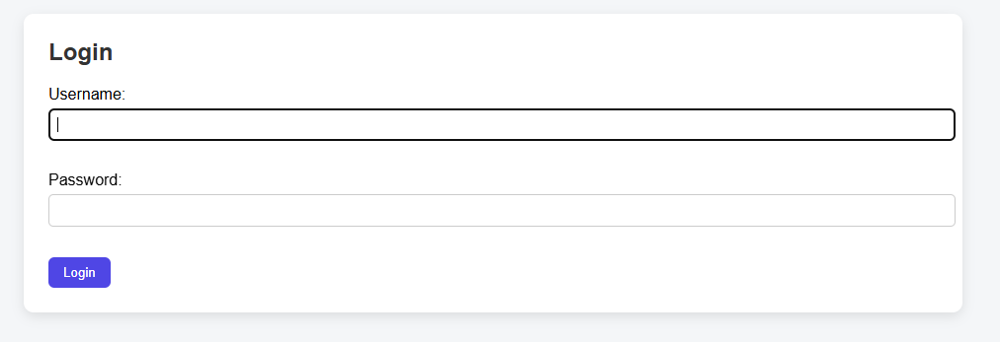
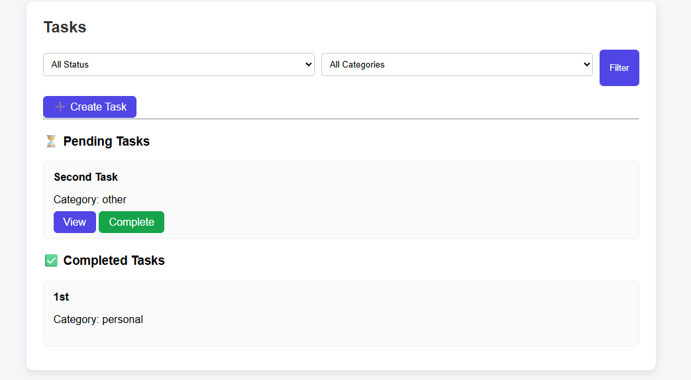

# Django Todo App

A clean and user-friendly Todo application built with **Django** that supports authentication, task filtering, categories, and completion tracking.

---

## 🚀 Features
- User Registration & Login
- Create, Update, Delete Tasks
- Mark Tasks as Completed
- Filter Tasks by Status & Category
- Clean UI (Simple)
- User-specific task isolation (secure)

---

## 🛠 Tech Stack
- Python
- Django
- HTML, CSS
- Mysql (development)

---

## 📸 Screenshots

### 🔐 Login Page


### 📋 Task List with Filters


### 📝 Task Detail View

---

## ⚙️ Installation & Setup

```bash
git clone https://github.com/yourusername/django-todo-app.git
cd django-todo-app
python -m venv env
env\Scripts\activate   # Windows
pip install -r requirements.txt
python manage.py migrate
python manage.py createsuperuser
python manage.py runserver
```

## 📌 Future Improvements
- REST API using Django REST Framework
- Docker support
- Email reminders
- Task priority levels
